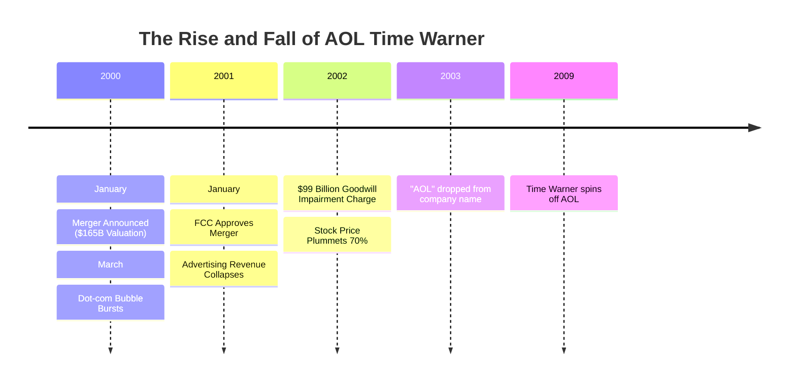

[](https://github.com/khushi2704rj-sephora/aol-time-warner-merger-analysis/actions/workflows/link-check.yml)

<div align="center">

# 📉 The AOL-Time Warner Merger: A Strategic Post-Mortem

[]()
[-blue)]()
[]()
[]()
[](LICENSE)

**An in-depth analysis of the "Deal of the Century" — a cautionary tale of valuation bubbles, culture clash, and failed synergy.**

[📄 **Read the Full Analysis**](reports/AOL%20Time%20Warner%20Merger%20Analysis.docx) · [📊 **View Presentation**](presentation/AOL%20Time%20Warner%20Merger%20PPT.pdf)

</div>

---

## 🏛️ Executive Summary

In January 2000, AOL acquired Time Warner for **$165 billion** in stock, creating the world's largest media company. It was hailed as the perfect marriage of "New Media" (Internet distribution) and "Old Media" (Content).

**The Result:** A catastrophic failure resulting in a **$99 billion loss** in 2002 (the largest annual loss in history at the time) and the eventual spin-off of AOL.

---

## ⏳ Critical Timeline



---

## 📉 Why It Failed: The Triad of Destruction

### 1. Valuation & Timing 💣
The deal was signed at the absolute peak of the Dot-com bubble. AOL used its inflated stock currency to buy real assets. When the bubble burst, the "New Media" premium evaporated efficiently.

### 2. Culture Clash ⚔️
*   **AOL:** Aggressive, young, chaotic, focused on quarterly growth and stock price.
*   **Time Warner:** Conservative, established, siloed, focused on long-term journalistic integrity.
*   **Outcome:** Massive internal friction; email systems didn't even integrate for years.

### 3. Failed Synergies 🔗
The promised "synergies" (cross-selling subscriptions, digital content distribution) never materialized due to broadband adoption lag and internal resistance.

---

## 📂 Repository Structure

```
aol-time-warner-merger-analysis/
│
├── reports/
│   ├── AOL Time Warner Merger Analysis.docx   ← 📘 Deep Dive Report
│   └── AOL Merger Analysis_Explanatory.docx   ← 📝 Explanatory Notes
│
├── presentation/
│   └── AOL Time Warner Merger PPT.pdf         ← 📊 Board-Level Presentation
│
├── LICENSE                                    ← MIT License
└── README.md                                  ← Project Documentation
```

---

## 🧠 Lessons for Modern M&A

1.  **Culture Eats Strategy for Breakfast:** No amount of strategic fit compensates for toxic cultural integration.
2.  **Beware the "New Paradigm":** Valuation metrics based on "eyeballs" rather than cash flow are dangerous.
3.  **Governance Matters:** The lack of due diligence on AOL's accounting practices (inflated ad revenue) was a critical oversight.

---

## 🤝 Contributing

Historical analysis is always open to re-interpretation. If you have data on the long-term impact on Time Warner's subsequent spin-offs (Time Inc., Warner Music), feel free to open a PR.

See [CONTRIBUTING.md](CONTRIBUTING.md).

---

<div align="center">

**Built with ❤️ for Corporate Strategy**

</div>